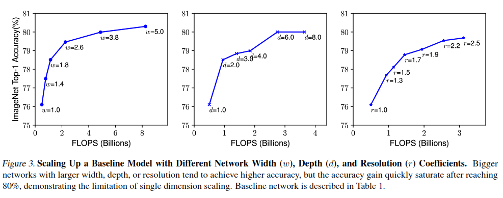
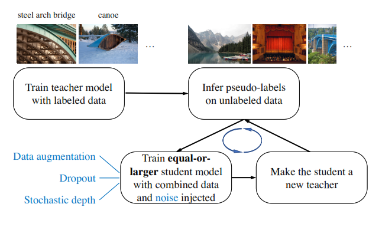

# Noisy Student

The article is the name of a self-training training method. 

With many methods help to avoid overfitting as Weight Init, ReLU-activation, Batch Normalization, Adapt Optimization and Residual Block besides the development of hardware and the unlimited data in this era. Increase the size of model will help them learn better, they proved it in EfficientNet paper

<figcaption>
Fig 1. EfficientNet paper shows result with deeper model, bigger input and more channel in each layer. 
</figcaption>

However, the accuracy is not increase forever, it has a limit around 80 percent. About data, normally, more data will lead to better model, the data can be unlimited but the annotated cost is very expensive and takes time. NoisyStudent is a method help we improve both data and model with what we have.

1. [Strategy](#strategy)
2. [Add noise in both data and model](#noise)
3. Other Techniques

### Strategy 
One of two different between Noisy Student and orther self-training methods that is they use the bigger or equal student than teacher. The other is noise, they add noise in both model and data, we will go in details later.

<figcaption>
Fig 2. Training process 
</figcaption>

Figure 2 show the training process of Noisy Student method. I will take the example similar with the author, that they used ImageNet as labeled image and JFT as unlabeled image dataset. In noisy student, they train a model with data with annotation, then use that model to predict the label of unlabeled data, and train a new model bigger or equal with total data set. 

We will go

did they use the same unlabeled data in iter training? Training from scratch (initilize all parameters), the performance will be better, prove in study #8
did they init the weight or use it from previous work?
did the first train have noise?

### Noise
kasdln

**Reference**
* [Original NoisyStudent paper](https://arxiv.org/pdf/1911.04252.pdf)