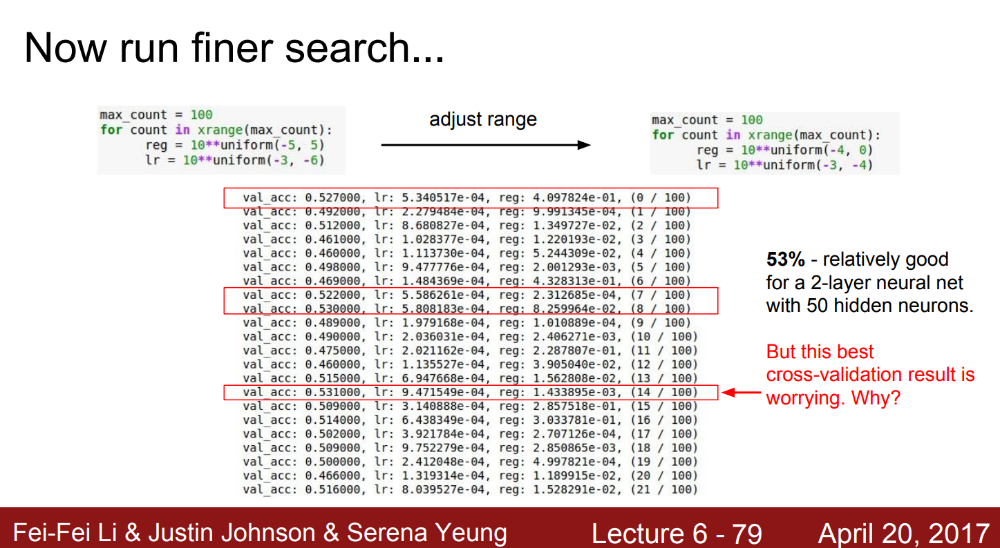

# Hyper-parameter optimization

In past, the process of selecting hyper-parameter is affected by many factors: is the model train from scratch, the distance between your dataset and the dataset of the pretrained model (ImageNet, CIFAR-100, etc), the complexity or how deep of your model, etc, in summary it depends on the engineer experience. 

However, recently, the benefit of searching or auto-correct the hyper-parameters overwhelms the traditional way via the flexible and even better performance of those methods. For example, for learning rate, we have [Cycle learning rate](https://arxiv.org/abs/1506.01186), [warm restart by reset learning rate with cosine fucntion](https://arxiv.org/abs/1608.03983) or for augmentation, the state-of-the-art is [Random Augmentation](https://arxiv.org/abs/1909.13719) or [Fast Augmentation](https://arxiv.org/pdf/1905.00397.pdf). 

This article is the beginning of the hyper-parameter optimization series where we introduce the familiar searching method which was introduced in the Stanford course (cs231n).

### 1. Cross-validation strategy 

The idea is similar to cross-validation in training strategy, train multiple model but not bag them together. 

* Step 1: select the range.
* Step 2: Take the value from the uniform distribution in step 1 range, train a few epochs with the random value to take the validation evaluation, save the result. (do this multiple time)
* Step 3: Comepare the result from step 2, watch the variance of the hyper-parameters of those best models $\Rightarrow$ repeat step 1 but with the more narrow range.

<center>

<figcaption>
Fig 1. Train model after adjust the range, image from Stanford university cs231n.
</figcaption>
</center>

In Figure 1, notice that even some results from the model were really well, but all the good results had learning rate values around 5e-4~9e-4 which means the range should be increased to get more opportunities that we can find a better learning rate. 

### 2. Grid search

List all the parameters that you think it will help to optimize your model, then run all the combination.

Pseudo code:

```python
# Assume that we need to select three hyper-parameters: learning rate, batch size and optimizer
learning_rate = [0.1, 0.01, 0.015 , 0.001]
batch_size = [4, 8, 15, 32]
optimizer = ['Adam', 'RMSProp', 'SGD', 'SGD_momentum']

best_accuracy = -1. # assume that the evaluation metrics is accuracy
for lr in learning_rate:
    for bs in batch_size:
        for optim in optimizer:
            val_acc = TrainModel(lr = lr, bs = bs, optim = optim)
            if val_acc > best_accuracy:
                best_hyper = (lr, bs, optim)
                best_accuracy = val_acc
final_hyper = best_hyper # this will be the best hyper-parameters for our model.
```

### 3. Random search

[The paper introduced random search](https://jmlr.csail.mit.edu/papers/volume13/bergstra12a/bergstra12a.pdf) was published by Yoshua Bengio and his partner in 2012, since it looks like the implementation of this paper is not so widely, I will come back to it later.

**Reference**
* [Grid search](https://stackabuse.com/grid-search-optimization-algorithm-in-python/)
* [CS231n lecture 6](https://www.youtube.com/watch?v=wEoyxE0GP2M&list=PLC1qU-LWwrF64f4QKQT-Vg5Wr4qEE1Zxk&index=6&ab_channel=StanfordUniversitySchoolofEngineering)
