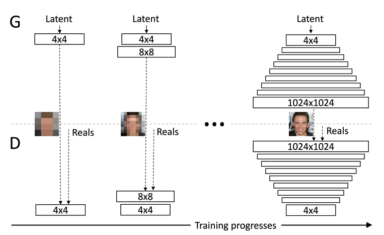
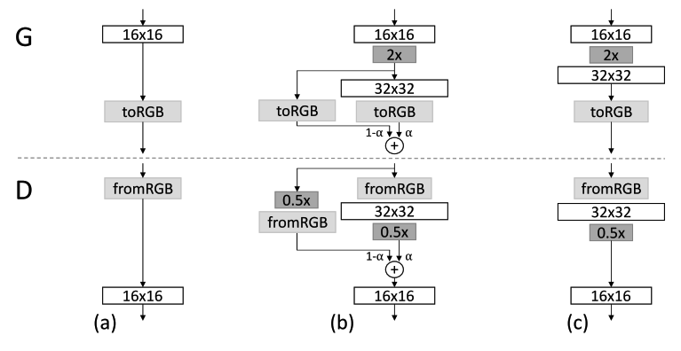

# Progressive Process

<figcaption>
Fig 1. Progressive training
</figcaption>

Take a look at Fig 1, we can see that they start to generate with low resolution image then append new layer to make it bigger. This idea was introduced that it will help to decrease the training speed and be greatly stabilizes.

**My opinions:**
* It is only speed up in case this is GANs since we cannot determine the convergence point which lead to infinity training time. In other task of computer vision, this strategy will cost more time to compare with traditional method (train everything from scratch).
* Surely, it will be much more stable, this was verify from 2014 since the author of VGG trained his model as this way - While he trained VGG, batchnorm still didn't publish so they have to do this to avoid vanishing/exploring gradient.

As I said above, it is hard to know when the model converges, so we need to set the threshold to know when we should append new layer. In this case, that threshold will be 800k images from Generator which success to fool Discriminator.

Another things we need to notice that Generator and Discriminator grow synchrony, one layer to Generator then one layer to Discriminator.

<figcaption>
Fig 2. Fade new layer smoothly
</figcaption>

However, we cannot just add the new layer like that, it will make the model be sudden shock by new weights initilize as random in new layer. They propose a method to slide the new layer smoothly as Fig 2.

Fig 2 take an example when model add more layer to increase the resolution from $16\times16$ to $32\times32$, some information:

* Image (a) is the model before append new layer, image (c) is our target, image (b) is how we really treat the layers while transition.
* `toRGB` is the `Conv2D` with kernal size $1\times1$, stride 1, padding 0, and output channels is 3.
* `fromRGB` is the `Conv2D` with kernal size $1\times1$, stride 1, padding 0, and input channels is 3.
* `2x` is up-sampling layer, nearest neighbor in this case.
* `0.5x` is down-sampling layer, average pooling in this case.
* $\alpha\in[0,1]$ is the hyper-parameter to control the momentum.
$\Rightarrow$ By this residual structure, we can slide the new layer smoothly, let, step by step help new layer converge.

**In Sumary:**
* Generate smaller image is more stable because there is less class information and fewer modes.
* By increasing the resolution little by little we are asking a much simpler task compared to generate a large image from the beginning.

[Back to the main page](summary.md)