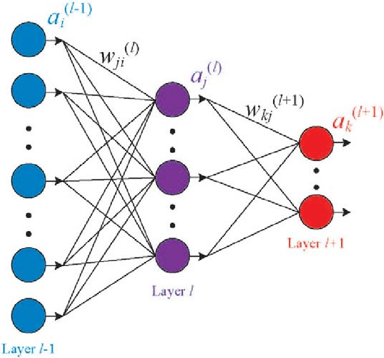

# Equalized learning rate

The author initilize the weight by normal distribution $N\thicksim(0,1)$ for all layers. 

After each time those layers parameters are called (each forward steps), they scale it with the [He's initializer constant](./../DeepLearning/weightInit.md) (the scale factor is the std of Normal distribution of Kaiming)  

```python
def forward(self, x, equalized):
    # generate He constant depend on the size of tensor W
    size = self.module.weight.size()
    fan_in = prod(size[1:])
    weight = math.sqrt(2.0 / fan_in)

    '''
    forward the module with the previous layer (x)
    A module example:

    import torch.nn as nn
    module = nn.Conv2d(nChannelsPrevious, nChannels, kernelSize, padding=padding, bias=bias) 
    '''
    x = self.module(x)

    if equalized:
        x *= self.weight
    return x
```
<!-- The modern initilization such as He or Xavior will makes some parameters need longer time to be convergence. Because of the different from its position to global minima, we will need different learning rate in different layers to get the global minima for all layers.  -->

<center>

<figcaption>
Fig 1. Fully connected layer
</figcaption>
</center>

\
Let take the Linear (Dense/ FC) layer in Fig 1 as example, assume that all input ($a_i^{l-1}$ in this case) is normalized in range $[0,1]$, keep assuming that all $w_{ji}^{(l)}$ is initilized by normal distribution with zero mean and unit variance ~$N(0,1)$. We have:

$$ \sum^M_{i=1}W^TX \backsim N(0,M)$$
where $M$ is the number of node of previous layer, as we can see, the variance of each output from later nodes will be shift by $M$ which called covariance shift problem. This will lead to the unstable learning speed, and harmful for the model.

With method scale weights with He's constant each time forward, we can guarantee that each next node will have normal distribution with zero mean and unit variance.

[Back to the main page](summary.md)

