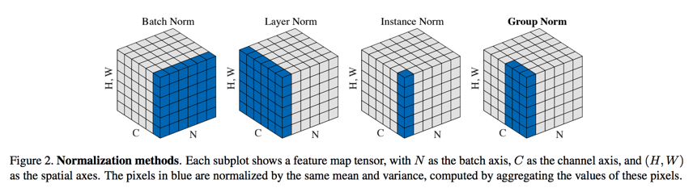
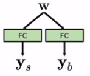

# Adaptive Instance Normalization (AdaIN)

<center>

<figcaption>
Fig 1. Some type of normalizations in deep learning
</figcaption>
</center>

As its name, this step is seperated to two parts, **Adaptive** and **Instance Norm**, we will start with instance norm first.

In Figure 1, it shows that instance norm take the mean and variance of each channel in each sample, the python code below shows how they compute mean and variance in instance norm.

```python
import numpy as np
# This code use the shape as NxHxWxC, it will be NxCxHxW in PyTorch.
batch_image = np.random.rand(10, 32, 32, 3) # a batch of 32x32 resolution images

# Batch Normalization
mean = batch_image.mean(axis = (0,1,2)) # output shape (3,)
std = batch_image.std(axis = (0,1,2)) # output shape (3,)
# mean = np.expand_dims(mean, axis = (0,1,2)) 
# std = np.expand_dims(std, axis = (0,1,2))
x = (batch_image - mean) / std # output shape (10, 32, 32, 3)

# Instance Normalization
mean = batch_image.mean(axis = (1,2)) # output shape (10,3)
std = batch_image.std(axis = (1,2)) # output shape (10,3)
mean = np.expand_dims(mean, axis = (1,2))
std = np.expand_dims(std, axis = (1,2))
x = (batch_image - mean) / std # output shape (10, 32, 32, 3)
```

<center>

<figcaption>
Fig 2. StyleGAN Generator architecture.
</figcaption>
</center>

Next we will move to other part, **Adaptive**. In Figure 2, we see that AdaIN take input is the vector from intermediate latent space. The formular of AdaIN is:

$$AdaIN(x_i,y) = y_{s,i}\frac{x_i-\mu(x_i)}{\sigma(x_i)}+y_{b,i}$$

<center>

<figcaption>
Fig 3. Affine transform from intermediate vector w to the adaptive vector y 
</figcaption>
</center>

The vector w has stable dimension - 512, so we need to put in into the dense layer to:

* Scale to be correct dimension.
* Generate more capacity for each AdaIN block.

This block allow StyleGan to transfor the intermediate latent vector to each CNN block, scale and shift whole block which affect to all parameters.

[Back to the main page](summary.md)


