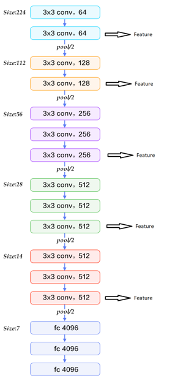
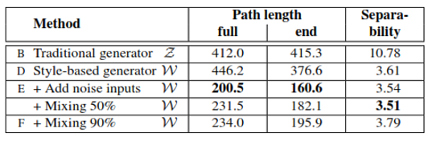

# Perceptual path length (PPL)

As I mentioned in [summary](./summary.md), this method is to evaluate the latent space or ensure the benifit of the intermediate latent vector $W$.

With the latent vector is the input of model, we expect the interpolation vector will leads to the linear change from output of vector 1 to output of vector 2. But with $Z$ domain, the author observe that there are some features is not appear in both images from vector 1 and vector 2.

Therefore, this **Perceptual path length** method help us to evaluate an input vector by find the distance between the image generated by interpolation vector $w$ and the once by a little shift from $w$. We have the formula:

$$l_{Z}=E\Bigg(\frac{1}{\epsilon^2}d(G(slerp(z_1,z_2;t), \\G(slerp(z_1,z_2;t+\epsilon))))\Bigg)$$

$$l_{W}=E\Bigg(\frac{1}{\epsilon^2}d(g(lerp(f(z_1),f(z_2);t), \\g(lerp(f(z_1),f(z_2);t+\epsilon))))\Bigg)$$

Where:

* $l_Z$ and $l_W$ are the path length of input from $Z$ and $W$ recpectively.
* Similarity, $(z_1,z_2)$ are vector from latent space $Z$ and $f$ in $f(z_1),f(z_2)$ is the [noise mapping function](./noiseMapping.md).
* $G$ and $g$ is the generator of ProGAN and StyleGAN respectively.
* $slerp$ is sphere interpolation, since we know $Z$ is sampled by Normal distribution with zero mean and unit variance which have the sphere fashion with radius is 1.
* $lerp$ is linear interpolation, since $W$ is transformed from $Z$ by learnable parameters so we can not guess the fashion of $W$, that why we used linear style.
* $t$ is a vector with the same dimension with $z$ and inited to Uniform distribution ~ $U(0,1)$
* $\epsilon = 10^{-4}$
* $d$ is the distance estimation method, in here they use VGG16 embeddings then compare the output feature maps as Figure 1 below.

<figcaption>
Fig 1. VGG embeddings
</figcaption>

I will not go in details how they calculate distance now, maybe will comeback later.

<figcaption>
Fig 2. PPL result
</figcaption>

Figure 2 shows the PPL result, **full** means $t$ is sampled by uniform distribution in range $(0,1)$ and **end** means $t\in{0,1}$. We can see that the relationship between input and output is show as the lower value with $W$ space, more clearly in **end** mode where the traditional input $Z$ cannot handle it.

[Back to the main page](summary.md)