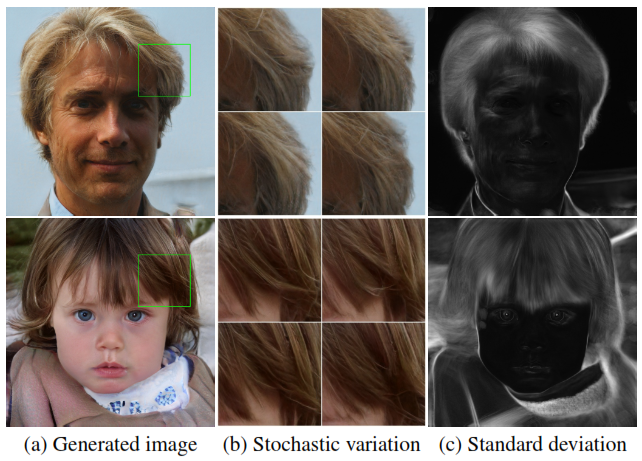
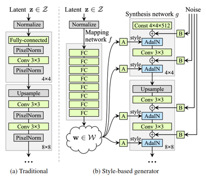
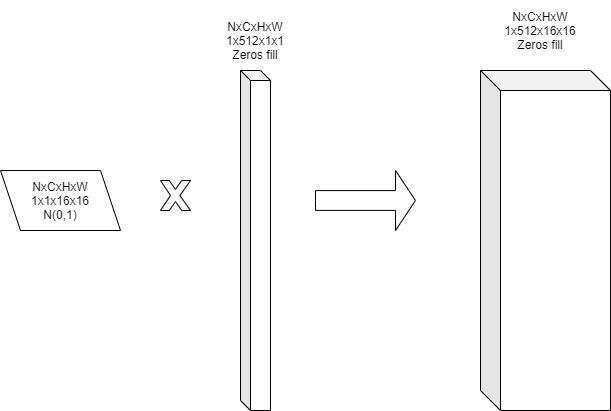

# Stochastic Variation

<center>

<figcaption>
Fig 1. What does we call stochastic variation? 
</figcaption>
</center>

Stochastic variaion can understand as small details, some information unpredictable in an image. In case we only care about human face in this case, those things will be placement of hairs, freckle, skin poses, etc. 

Take a look at Figure 1, the middle image was generated from same stucture with a little different in their (or its? becasue they are note real, so hard to vocate) hair. 

For normal GAN architecture, we know that it only take a random vector as input, so all the information in output image was inherited from this vector, so if the model want to control the small details as stochastic variation, it should have enough both capacity and flexibility to control it. 

The capacity can be handle with increase the number of parameters, but the flexibility is really hard to control since we only have one input $\Rightarrow$ the model normally will generate those stochastic information repetitive.

$\Rightarrow$ Our solution should be give more input options in our model and let them more various (best is learnable).

<center>

<figcaption>
Fig 2. Style GAN generator architecture 
</figcaption>
</center>

Figure 2 shows the way they control stochastic variation, they add the Noise tensor as the block B in image. 

<center>

<figcaption>
Fig 3. B block architecture
</figcaption>
</center>

Figure 3 take the resolution $16\times16$ as example:

* Firstly, create a random matrix with the same resolution with what we want to add
* Secondly, we multiply it with the vector with learnable parameters
* Then add it to the tensor output from convolution layer.

By this way, the noise will be add in per-pixel of each tensor, and it can be control by the model thanks to the learnable vector. Because the effect of noise appears tightly localized in the network, so the author decide to add noise in all layers of generator. $\rightarrow$ In my oppinion, it also because Instance Normalization reduce or even destroy the effect of noise from previous layer.

However, it raise another question: "why both of them are noise, the [AdaIN](./AdaIN.md) (transfer style into model) have global effects (pose, identity, gender, etc) but the addition noise  only affect to the stochastic variation?"

The answer is because in AdaIN, complete feature maps are scales and shift with the same values so it has strong effect to image. In the other hand, the noise is added independently to each pixel with should change little bit.

[Back to the main page](summary.md)

### Additional part

<center>

<figcaption>
Fig 4. Tabikaeru image, left is original, the middle is scale and shift as style transfer and the right represent for add noise
</figcaption>
</center>

In Figure 4, I simply use an image in my PC (left image), after normalize it with 255, I generate 2 vector 3 dimensions for scale and shift as input style in AdaIN, then generate a random matrix and a vector 3 dimensions, multiply together then add to image as the method in this article. (All the parameter is initilized by normal distribution with zero mean and unit variance with seed 40, take a look at the code below).

We can see that with the same value init but the style block affect the whole block while the noise only make the image brighter and a little noisy.

```python
import cv2
import numpy as np

def tensor_to_image(tensor):
    # convert tensor to image
    tensor *= 255.
    tensor = np.clip(tensor, 0, 255)
    return tensor.astype(np.uint8)

def style(tensor):
    # apply similar with style block (no normalization here)
    num_features = tensor.shape[-1]
    factor = np.random.rand(num_features*2)
    scale = np.expand_dims(factor[:num_features], axis = (0,1))
    shift = np.expand_dims(factor[num_features:], axis = (0,1))
    return tensor_to_image(tensor*scale + shift)

def addition_noise(tensor):
    # apply stochastic variation part
    h,w,num_features = tensor.shape
    matrix = np.random.rand(h,w,1)
    scale = np.random.rand(1,1,num_features)
    return tensor_to_image(tensor+ matrix*scale)

def combine_image(image):
    # Combine to show
    style_image = style(image)
    noise_image = addition_noise(image)
    image = tensor_to_image(image)
    h,w,c = image.shape
    gap = np.zeros((h,30,c)).astype(np.uint8) + 150 # generate gap between image
    stitch_image = np.concatenate((image, gap, style_image, gap, noise_image), axis = 1)
    return stitch_image

if __name__ == '__main__':
    np.random.seed(40)
    path = '/home/user/tabikaeru.png'
    image = cv2.imread(path)
    image = image.astype(np.float32)/255.
    image = combine_image(image)
#     cv2.imwrite('/home/user/tabikaeru1.png', image)
    cv2.imshow('image',image)
    cv2.waitKey()
    cv2.destroyAllWindows()
```