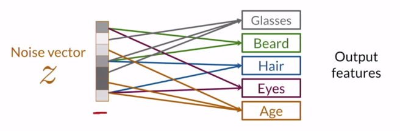
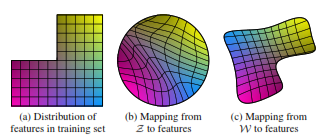
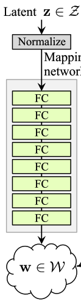
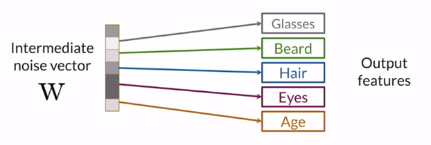

# Noise Mapping

<figcaption>
Fig 1. Standard GANs models
</figcaption>

Normally, in an CNNs model, take the classify cation as the example, we know that CNNs extract feature from image through multiple learnable kernels then dump they into a vector where we know that each element in that vector represent for a feature in that image.

Generator in GANs do the opposite, it generate the image from a vector, interpolate from the previous, each element of that vector should represent for a feature/attribute of result image (Figure 1 shows the input vector in normal GAN model).

<figcaption>
Fig 2. Mapping noise vector to features
</figcaption>

<figcaption>
Fig 3. Standard GANs models
</figcaption>

However, as we see in Figure 2, the connections between noise vector $Z$ and the attributes are really entangled, which means if one value is slightly change, all the image structure will be affect. The reason of this problem is because the different distribution, as we know, $Z$ elements come from Normal distribution with zero mean and unit variance, which means it's distribution will have the sphere fashion (Fig 3b) when the distribution of features in training set is unpredictable (Fig 3a). 

<figcaption>
Fig 4. Mapping network to transform from Z to W
</figcaption>

To reshape the distribution of noise vector to let it has traning dataset shape, they build the simple network called **Mapping Network** which contain 8 FC layers with activation is Leaky ReLU $\alpha = 0.2$ after each layer, the output of that model called **intermediate latent space $W$**.

<figcaption>
Fig 5. Mapping intermediate noise to features
</figcaption>

Figure 5 shows our target where we want each element in $W$ should control an attribute or in order way, we should know that $W$ will decide is it a male or female. How we get the result as Figure 2 and 5 will be explain in [Linear Separability part](./LinearSeparability.md).

After we get vector $w \in W$, it was transfered into Generator as the special ways which was described in more details in [AdaIN article](./AdaIN.md).

**Noted:** Increase the depth of mapping network make it unstable with high learning rate so with mapping network the learning rate equal $\lambda'=0.01\times\lambda$ 

[Back to the main page](summary.md)