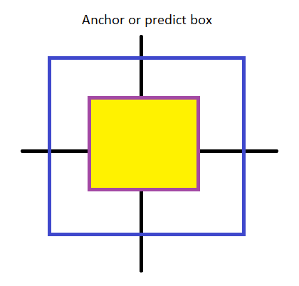

# Ground truth modify

Okay, this maybe is a little bit weird, but we actually have to edit a lot of thing for matching the groud truth with the result from model (at least in yolo problem).

This article was written depend mainly on the code of [this repo on Github](https://github.com/qqwweee/keras-yolo3), so I will assume a lot of thing like him, but the idea is still the same with all YOLOv3 repo.

Assume that the annotation will be a text file with the form like this 
    
    C:/Users/name/Desktop/data/image1.jpg 50,100,150,200,0 30,50,200,120,3
    C:/Users/name/Desktop/data/image2.jpg 20,10,100,80,0 50,80,70,100,1 0,120,30,300,4
    C:/Users/name/Desktop/data/image3.jpg 100,130,160,180,2

With the structure of each line will be ***image_path box1 box2 ... boxN***
And each box format will be ***x_min,y_min,x_max,y_max,class_id***

With YOLOv3, the output of model will be $(grid_i\times grid_i \times(c+5))$ with the $grid_i$ depend on the anchors and input size, $c$ is number of classes and $5$ present for $(x_{min},y_{min}, x_{max},y_{max},confidence)$.

For example, with input is color image with size $(416\times416)$, $9$ anchors, and $80$ class (standard COCO dataset) 
$\Rightarrow$ Output should be $3$ tensors:
* $(13\times 13 \times(80+5))$
* $(26\times 26 \times(85))$
* $(52\times 52 \times(85))$

Our task in this article is how to encode the annotation to that 3 tensors form.

<center><figcaption>Fig 1. IoU between anchor and predict box problem</figcaption></center>

### Follow the steps:
  1. Convert the size and position of each box to the position on $(416\times416)$ image and still keep the same ratio (keyword: *letterbox resize*)
  2. Take a look on Figure 1, we assume that anchor and predicted box have a same center, then calculate the IoU between them, the highest IoU index will be the anchor index of that box.
  E.g: A box is predicts as ```50,100,150,200,0```
  An YOLOv3 anchor is ```[10,13],  [16,30],  [33,23],  [30,61],  [62,45],  [59,119],  [116,90],  [156,198],  [373,326]```
  The IoU result will be ```[0.013      0.048      0.0759     0.183      0.279      0.53052783
  0.78671329 0.32375032 0.08223819]```
  $\Rightarrow$ The biggest IoU has index is 6 so this box belong to 6th anchors (if count from 0th)

  3. First, normalize all box to range $(0,1)$ by devide $x,y,w,h$ with $416$. Then, follow those steps, call all boxes in ground truth in image $i$th is $B_i$
* Check the anchor index we calculated in example above, in this case it's 6, which means the big box, so it will be long to grid $13\times13$
* Let the normalized $(x,y)\times13$ to get the position follow the grid
* Match the result into $13\times13$ map, all others should be $0$, and turn the confidence score and the class position in the tail $80$ in $5+80$ to 1  
    

