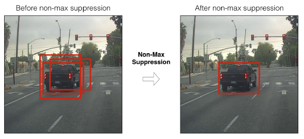

# Non-maximum Suppression

In this article, we will mention about the regression (bbox, confidence score) in object detection task. Normally, a model will follow these step:

1. Predict a bunch of bbox with value $(x,y,w,h,p)$ with $(x,y)$ is center and $(w,h)$ is width and height of each bbox, $p$ is confidence score.
2. Define a confidence theshold (usually >0.5) then reject all boxes lower than that threshold.

<figcaption>Fig 1. Non-max suppression problem</figcaption>

The problem here is some time, the remanding boxes are overlap with the same one object, take example at Fig 1, so **Non-max suppression** was born to solve this problem.

So how to implement it? 

Assume that after the rejection step above, we have $N$ boxes left, then define an IoU threshold $T$ (The definition of Iou can be found in [this article](./../evaluate/ObjectDetectionEvaluate.md)). **NMS** will be done follow these step:

1. Choose the box with biggest confidence score, call it is box $S$, remove $S$ out of the boxes set
   1.1. Calculate the IoU between $S$ and other box $C$ in the remanding boxes set
   1.2 If $IoU \ge T$, remove $C$
   1.3 Repeat tep 1.1, until $S$ can compare with all box.
2. Save $S$ as result list, back to step 1, continue to choose other box with highest confidence score until there is no box left.
   
**Weakness**

As we can see, all of this NMS algorithm depend on how to chose threshold $T$, so there will be the probability that two object stand side by side but the box with high confidence of object one or object two is removed.

**Note**
NMS is only implemented in the testing phase.

**Reference**
* [Medium articles](https://towardsdatascience.com/non-maximum-suppression-nms-93ce178e177c).
* [Andrew Ng CNN course](https://www.coursera.org/lecture/convolutional-neural-networks/non-max-suppression-dvrjH).