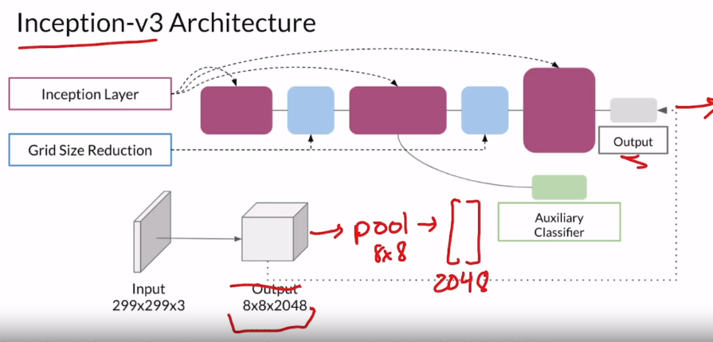

# Fréchet Inception Distance (FID)

Frechet Inception Distance is kind of the upgrade version of Inception score, where they still use Inception v3 model but for features extraction (not return the probability as IS). The reason of that name is because they use Frechet Distance to evaluate the different from two features vector.

### 1. Feature extraction

<figcaption>
Fig 1. Inception-v3 architecture (image from coursera video lecture)
</figcaption>

Figure 1 shows the Inception-v3 architecture, we will not discuss about its structure and why they select this model but not the others, we only need to know that:

* Inception-v3 is similar as any others classifier model, extract the features in through each convolution layer, the later the more semantic. 
* In this case, we know that the output $8\times 8 \times 2048$ is the last CNN block, let it through a pooling layer and we have a feature vecter where each element in that vecter represents for the probability of feature $i$-th present in that image. ($i\in [1,2048]$)

### 2. Fréchet distance

