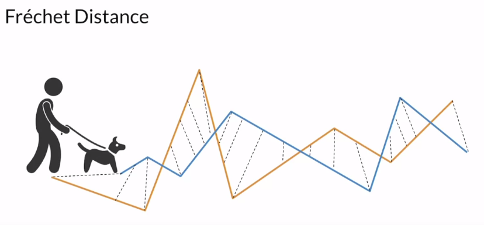
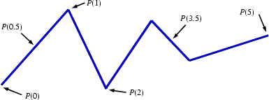

# Fréchet Inception Distance (FID)

Frechet Inception Distance is kind of the upgrade version of Inception score, where they still use Inception v3 model but for features extraction (not return the probability as IS). The reason of that name is because they use Frechet Distance to evaluate the different from two features vector.

### 1. Feature extraction

<figcaption>
Fig 1. Inception-v3 architecture (image from coursera video lecture)
</figcaption>

Figure 1 shows the Inception-v3 architecture, we will not discuss about its structure and why they select this model but not the others, we only need to know that:

* Inception-v3 is similar as any others classifier model, extract the features in through each convolution layer, the later the more semantic. 
* In this case, we know that the output $8\times 8 \times 2048$ is the last CNN block, let it through a pooling layer and we have a feature vecter where each element in that vecter represents for the probability of feature $i$-th present in that image. ($i\in [1,2048]$)

### 2. Fréchet distance

<figcaption>
Fig 2. Walking with his dog (image from coursera video lecture)
</figcaption>

A very famous example for Fréchet distance is to image follow: suppose a man is walking his dog and he also keep moving forward as in Figure 2 where the man movement follow the yellow line and the dog follows blue line. Their speed can be variance but they will never go backward.

Fréchet distance show the **minimum** length of the leash that is necessary.

<figcaption>
Fig 3. Movement of the man only.
</figcaption>

Take a look in Fig 3, now we only focus on the man line, call the polygonal curve is $P$ with parameter $\alpha$, the length of the line is $N$ (in this case $N=5$), so we get the position of the main at the length $\alpha$ is $P(\alpha)$ (as image we get $P(0),P(0.5),...,P(5)$, $\alpha$ is linear increasing but the position of the main is always move forward).

We know that the distance the man can go depends on movement time, so we can write the distance equation is $\alpha(t)$ which is continuous and increasing. Here, we assume that in **one period**, the man will finish the curve, so time here is not in any standard unit (second, minute, hour, etc) but in period which mean $t\in[0,1]$

Now assume the similar definition of the dog, we have the polygonal curve of the dog is $Q$, and distance equation is $\beta(t)$ and the maximum length of dog line is $M$.

We know that $P$ and $Q$ are two stable curves, but there are many ways to define $\alpha(t)$ and $\beta(t)$ with the rule $\alpha(0) = 0$ and $\alpha(1) = N$, similar $\beta(0) = 0$ and $\beta(1)=M$.

To verify the idea of Frechet distance, we can write the equation:

$$ \delta_F(P,Q) = \displaystyle\min_{\begin{smallmatrix}
\alpha[0,1]\rightarrow[0,N]\\
\beta[0,1]\rightarrow[0,M]
\end{smallmatrix}} \{\displaystyle\max_{t\in[0,1]}d(P(\alpha(t)),Q(\beta(t)))\}$$

That equation can be read like: "*for every possible function $\alpha(t)$ and $\beta(t)$, find the largest distance between the man and its dog as they walk along their respective  path; finally, keep the smallest  distance found among these maximum distances*".

**Note:** function $d$ is the distance function, in most case, they assume it is Euclidean distance but we can also use other distance function.

### 3. Frechet Inception Distance

The Frechet Distance can be extended for probability distribution, in case Normal Distribution, the distance between two Normal distribution $X$ and $Y$ in case **univariate** could be defined as:

$$d(X,Y)=(\mu_X-\mu_Y)^2 + (\sigma_X-\sigma_Y)^2 [1]$$

For **multivariate** normal Frechet Distance:

$$ d(X,Y) = \lVert\mu_X-\mu_Y\rVert^2+ Tr(\Sigma_X+\Sigma_Y-2\sqrt{\Sigma_X\Sigma_Y})[2]$$

where $Tr$ is [the trace](https://en.wikipedia.org/wiki/Trace_(linear_algebra)) of the matrix.

If we extract the exponential equation in formula $[1]$, we can see the similarity between them $[1]\Leftrightarrow d(X,Y)=(\mu_X-\mu_Y)^2 + (\sigma_X^2+\sigma_Y^2-2\sigma_X\sigma_Y)$

Now, as we discuss on **part 1**, after extract, each image will return a feature vector, so call $X$ is the real dataset with $N$ images (30000 in case CelebA), we will get $\mu_X$ and $\Sigma_X$. Similarity, assume $Y$ is fake image set, the author recommend that set size should be at least 50000 to reduce the noise.

***Weakness:***

* Used pretrained model which may not capture all features (the features are strongly depends on the structure of training images)
* Need a very large sample size
* Slow processing
* Only depend on mean and covariance.

**Reference**
* [FID paper](https://arxiv.org/abs/1706.08500)
* [Cousera lecture](https://www.coursera.org/learn/build-better-generative-adversarial-networks-gans/lecture/LY8WK/frechet-inception-distance-fid)
* [A explaination about Frechet distance](http://cgm.cs.mcgill.ca/~athens/cs507/Projects/2002/StephanePelletier/#:~:text=2.-,What%20is%20Fr%C3%A9chet%20distance%20%3F,not%20allowed%20to%20go%20backwards.)