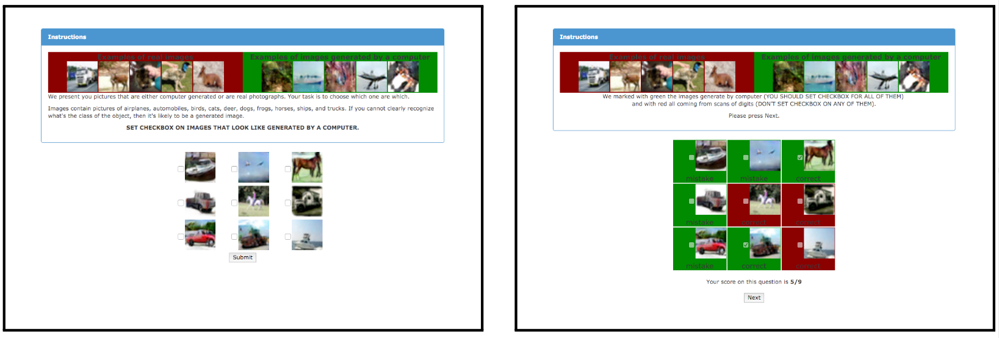
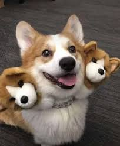
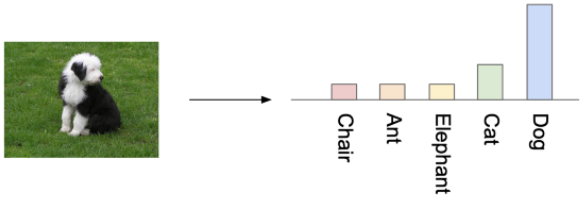
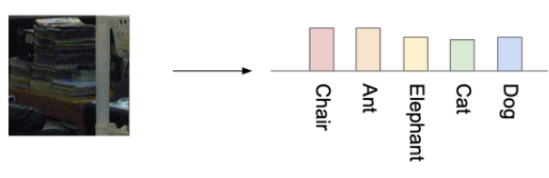
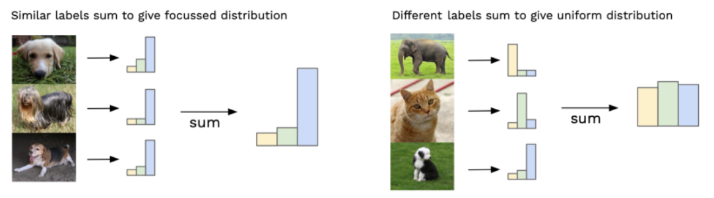

# Inception score (IS)

<figcaption>
Fig 1. Evaluation as Survey
</figcaption>

Generative Adversarial Network is an interesting branch in computer vision. However, in past, there was no standard method to evaluate the model (even no ground-truth in GANs). Therefore, to answer the question which GANs model is better, they used human evaluation.

By create a website where they can select which one is from GANs and which one is real. However, the annotators is quickly overfit after they have the result of the survey.

Inception Score was introduced to make this heavy task to automatic. The name Inception come from using Inception model with pretrained from ImageNet to predict image created by generator.

### Process

First, what we need from a generator model is the **Fidelity** and the **diversity**. 

<figcaption>
Fig 2. Cerberus cute version
</figcaption>

Image that we ask our model to generate some meaningful object, and we have the result as Fig 2. Okay, a cute Corgi, look perfect, but wait ..., something wrong, it is actually not what we want. Therefore, the Fidelity here can be understanded as $p(y\mid x)$ where it is the probability come from the Inception model.

<figcaption>
Fig 3. Low Entropy
</figcaption>

<figcaption>
Fig 4. High Entropy
</figcaption>

**Note:** Entropy is the variable show the chaos in statistics, an event with low entropy means you can easily to guess its result. The opposite thing happen to the high entropy event. 

Take a look at Figure 3, the Inception model return a very clear answer what is that image label which mean $p(y\mid x)$ get a very low entropy in this case. Now let move to Figure 4, where model is not sure what is the correct class of this image which lead to the probability distribution as **uniform** $\Rightarrow$ high entropy.

$\Rightarrow$ Each image come from generator should have low entropy after input to Inception model.

However, we do not want our model can only generate dog, right? We also want it generate somethings else as cat or elephant, etc. In mathematics way, we want the entropy of $p(y)$ be as high as possible ($p(y)$ gets uniform shape).

The the marginal $p(y) = \displaystyle\sum p(y|x=G(z))$ where we can understand that we should sum all the $p(y\mid x)$ of every images from Generator.

<figcaption>
Fig 5. Summation of all image distributions
</figcaption>

To get the general margin, we have to take enough sample from generator, the original author suggest the number 50k generated image. 

Notice that if every single labels has high entropy, the different labels sum will have high entropy, but if the single labels has low entropy, there are two options for the summation of different labels

* High entropy (this is what we need).
* Low Entropy (similar with each single label).

Therefore, we need a formula to find the different range between each single label with the summation. Luckily, we have Kullback–Leibler divergence formula (KL-divergence). Follow [wiki](https://en.wikipedia.org/wiki/Kullback%E2%80%93Leibler_divergence), the definition of KL-divergence of discrete signals is:

$$ D_{KL}(P||Q)= -\displaystyle\sum_{x\in X} P(x) log \Bigg( \frac{Q(x)}{P(x)} \Bigg) $$

where: 
* P and Q defined on the same probability space
* X is the sample space, in this case is the length of X is the number of label from ImageNet. ($x\in X$ where $x\in[0,1] and \displaystyle\sum x= 1$)

Our target is to maximize $D_{KL}$ (even the it can be infinity). The bigger number means the more diffrent between two probability space. In paper, the author take the exponential to easier to compare, out task become maximize:

$$ IS(G) = \exp{(\mathbb{E}_{x}D_{KL}(p(y,x)||p(y)))}$$

Remember $x$ in this case is the image from Generator.

***Weakness:***
* fds

**Reference**
* [Inception score paper](https://arxiv.org/abs/1606.03498)
* [An explaination blog about Inception score](https://medium.com/octavian-ai/a-simple-explanation-of-the-inception-score-372dff6a8c7a)