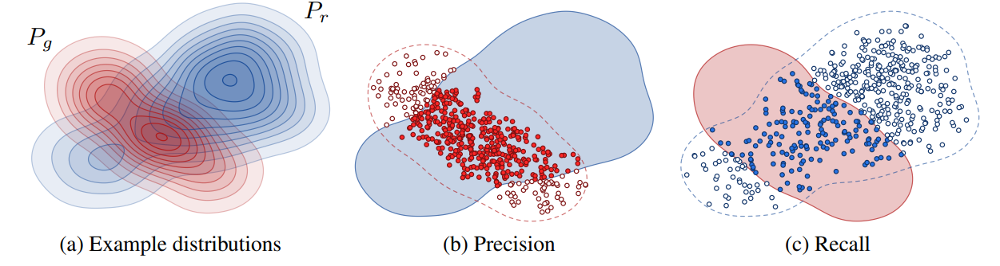

# Precision and Recall

Precision and Recall are standard evaluation metric with the simple idea:

* Precision: the percentage of correct output from model among the output that model thinks it is correct.
* Recall: the percentage of correct ouput from model among the real correct once.
  
Based on those ideas, Precision and Recall have different definition among different task in deep learning. This articles will describe how they evaluate those metrics in GANs problem.

<figcaption>
Fig 1. (a) Distribution of real and fake set (b) Precision visualization (c) Recall visualization
</figcaption>

We know that there is no ground-truth in GANs, so what we need is the similarity between the distribution of images from Generator and the real images from dataset.

Figure 1a assume the distibution from generator is $P_g$ and the distribution from real images is $P_r$. Precision was declared as the fraction between the overlap area between $P_g$ and $P_r$ with the area of $P_g$ as Figure 1b

$$\Rightarrow Precision=\frac{P_g\cup P_r}{P_g}$$

Do the same thing we can get the formula of Recall:

$$Recall = \frac{P_g\cup P_r}{P_r}$$

Look at the formula, we can know its meaning, the closer **Precision** with 1, the more **Fidelity** your model get since its produce the same images as dataset. However, we cannot guarantee the **Diversity** with Precision only, so we need **Recall** to show it.

<figcaption>
Fig 2. An example for modern Generator.
</figcaption>

State-of-the-art GANs model tends to generate with the distribution similar as the blue area in Figure 2 which help we understand why **truncate** the input noise range help to increase FID.

**Reference**
* [Precision and Recall for GANs paper](https://arxiv.org/pdf/1904.06991.pdf)
* [Coursera](https://www.coursera.org/learn/build-better-generative-adversarial-networks-gans/lecture/dgKdL/precision-and-recall)
