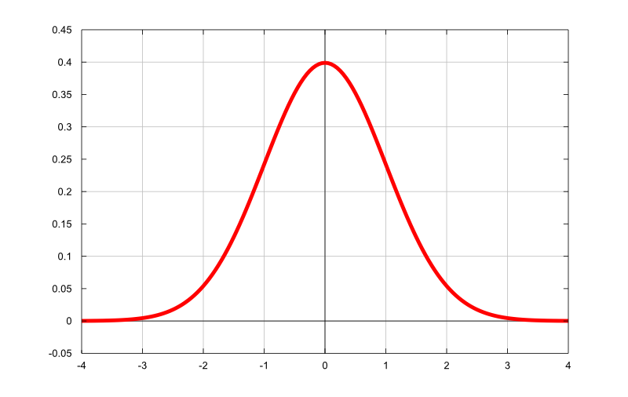

# Different between two probability distribution

Firstly, we need to know what is probability distribution?

<figcaption>
Fig 1. Normal distribution with zero mean and unit variance
</figcaption>

Take a look at Figure 1, let call that distribution is $P$, we can understand that if image like this: "For $n$ with $n\in \N$ samples take from the distribution $P$, we will have $40\%$ of those samples have zero value and keep reduce to both size (sample is closer to one or minus one). 

Based on that idea, we can define the distibution for 2-D or higher dimensions space