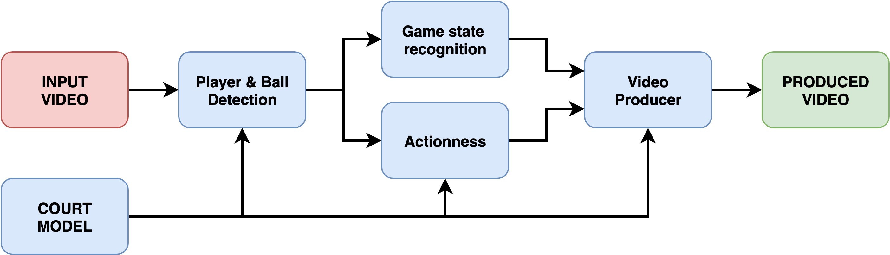
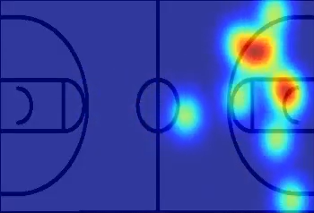
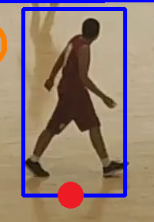
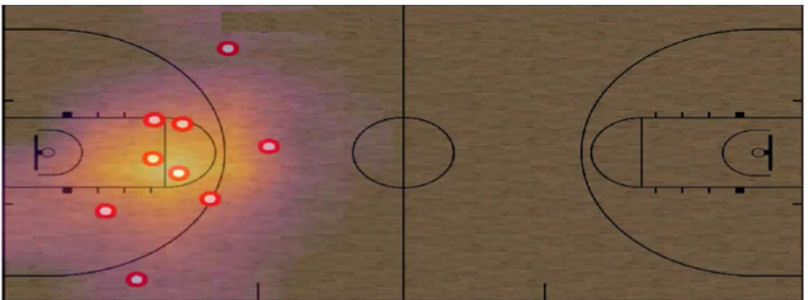
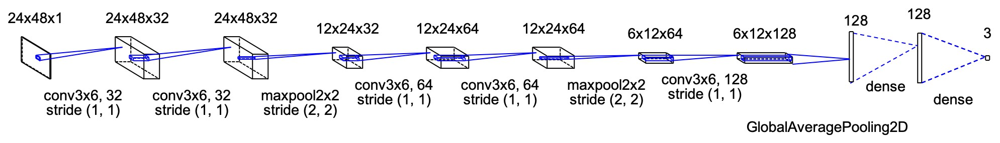

# Automatic Basketball Video Production using Gaussian-based Actionness and Game States Recognition

<figcaption>Fig 1. Diagram show the relationship of all System's blocks</figcaption>

Some basic information, the input video can have resolution is $4K$ or $1280\times1024$, the result example can be found at [this youtube](https://www.youtube.com/watch?v=3GUsAROG9Z4).

We will go in details of each block in Figure 1 first then discuss how they work together and why need them later.

### 1. Court Model

The camera calibration from robotic will be apply in this part. 

First, assume the camera will be fixed (can not be move or translation).

Try to estimated the homography $H$, it is the matrix help to convert a point from image plane $(x,y,1)$ to 3D coordinate (real-life) $(X,Y,Z)$.

<figcaption>Fig 2. The court  and the estimating coordinate</figcaption>

By assume the center of the real world coordinate is the center of the court, we will get $(0,0,0)$ point in the center and XY-lane corresponding to the ground plane $\Rightarrow \text{the plane equation will be }X+Y+0\times Z=0$.

The estimate homography is calculated by formula:

$H(x,y,1)^T=KR[I-C](X,Y,0,1)^T$

Where:
* K is the intrinsic matrix
* R is a rotation matrix from world to camera coordinates
* C is the camera's center of projection in the world coordinates

Both the equation and all parameters in there belong to the camlibration of robotic so it is not explained in this part, put it in future work (a very long future).

After having the matrix $H$, from 4K video, they crop the resolution down to 16:9 aspect ratio, but still make sure each frame still contain the whole court.

### 2. Players and ball detection

For the balanced between the running time and accuracy, they chose **YOLOv3 with some modify** for object detection task.

**YOLOv3** features in this case:
* The input image will be $608\times608$
* The anchor boxes was re-computed on new dataset by k-means.
* "Disconnect layer 36 in the combined feature map and connect instead the layer 11, to be able to detect small objects" $\rightarrow$ not sure what they mean, I will wait until they public the code for more information.

Training method:
* Start with the original weights trained in **COCO**, they first fine-tuning the parameters with **CrowdHuman** and **Google sports** dataset with 1 class only, **the players**. 
* Add **ball** into class list, then continue train model with **APIDIS** and **SPIROUDOME** dataset.
* To improve accuracy and detection performance, they crop the rectangle area which contains the court (See Figure 3), then resize it to $1024x192$ (this ratio is nearly the same with the court w and h ratio in this case - already test by code). Add **referee** into class list, label and train on the test video $\Rightarrow$ This class will be overfit in testing time.

### 3. Actioness

Assume the court is two-dimention coordinate shows the distribution of players as Figure 3.

<figcaption>Fig 3. The actioness map</figcaption>

#### 3.1. Actioness Function

<figcaption>Fig 4. Position of players </figcaption>

Assume that the position of the player is the middle bottom of their bbox from modified YOLOv3 as Fig 4. Called $x^i_c=(x^i_c,y^i_c)$ is the location of each player on image plane, and apply the projection method we have in the first part

$\bold{\overline{X^i_c}}=H(x_c^i,y_c^i,1)=(\overline{X^i_c},\overline{Y^i_c},\overline{Z^i_c})$

The actioness function is defined as:

$\mathscr{A}(\bold{X})=\frac{1}{2\pi \sigma} \displaystyle\sum_i exp(-\frac{1}{2}(\bold{X}-\bold{X}_c^i)^T \textstyle\sum^{-1}(\bold{X}-\bold{X}^i_c))$

There still a lot of question about this part (why this formula, what is $\bold{X}$, is it a mean?), in summary it will show the distribution of player (action) through $\mathscr{A}(\bold{X})$

#### 3.2. Action Localization

The ball should be always in frame, apply a bi-dimensional convolution with height and weight of filter are $\frac{1}{4}$ of the court $\rightarrow$ help action localization easier????

$\mathscr{A}_s(\bold{X})=\mathscr{A}(\bold{X}) * rect(court/4)$

The action value will be $\bold{X}^*=argmax\mathscr{A}_s(\bold{X})$

Okay, there are a lot of weird thing here, anyway, let's go to the summary, I hate this kind of paper, they promised many things but have not done nothing, even haven't replied my email.

In summary, the action value will let we know when the player stick together and when they are scattered, if in the second condition, they will divide the vertical coordinate (in ROI area only) to 5 equal part and the ball is expected to be in 2,3,4 parts. If not, the horizontal value of $\bold{X}^*$ will be modified until the ball in there, and please don't ask me how (feel like still reading psDirector)

### 4. Game State Recognition

Classification problems with game state, there are three pre-defined game states: transition, half-court and not-playing

#### 4.1. Player Occupancy Map

<figcaption>Fig 5. Position of players </figcaption>

Localize players on court as Fig 4, then divide the court to many grid with size ($N_X,N_Y$) (in this case $N_X=48$ and $N_Y=24$). The occupancy map $\bold{X_h}$ is the matrix (map) shows number of each players on each cells with size $(N_X,N_Y)$.

#### 4.2. Recognizing Game States with CNN

<figcaption>Fig 6. State classification model </figcaption>

Consider the occupancy map $\bold{X_h}$ is a gray scale image input, use a simple CNN model as image to choose the correct stage.

### 5. Video Producer

The input will be everything above and the output is ROI cropped from the input image and auto resize it (720p or 1080p). Ensure the smooth of the scene by define $M_{max}$ the maximum movement in pixels per frame.

The system will devide in three game states as above, each state will have it own a way to execute the input image.

**Noted:** The system will return the action function value, the action value, and game state for each frame in video.

* Transition Production
  This situation usually happens when a ball goal, and one team have to start from their field and the attacking direction is moved from left to right or vice versa.

  Use [the one-euro filter](https://hal.inria.fr/hal-00670496/document) to present the high-frequency variations from $\mathscr{A}_s(\bold{X})$. The action value $\bold{X}^*$ was calculated and make sure it is in the acceptable range from the previous center point.

  The output is croped from original image with center is X and size if the average of the half-court framings. 

* Half-court Production
  If a frame is predicted to be this state, the cropped image will move smoothly to this frame from the previous ROI position, in both location and scale.

  If a set of continuous frames is decided to be this state, the ROI will move towards to the framing near the main action coodinates $\mathscr{A}_s(\bold{X})$.

* Not-playing Production

  This state is usually appear in pre-gaem interval, warmups or end of period intermissions and timeouts.

  The ROI will gentle slowly zoom out form current positions without exeeding the displacement limit until the state changes.

**Reference**
* [This paper](https://openaccess.thecvf.com/content_CVPRW_2020/papers/w53/Quiroga_As_Seen_on_TV_Automatic_Basketball_Video_Production_Using_Gaussian-Based_CVPRW_2020_paper.pdf)

